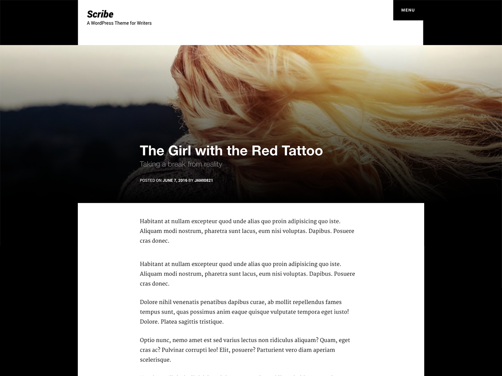

### Scribe WordPress Theme

Scribe is a WordPress theme that excels as a writing presentation tool. The focus is on your words. You'll have access to several customization settings within the native WordPress Customizer such as sitewide colors, logo image, and custom background image settings.



### Installation

1. In your admin panel, go to Appearance > Themes and click the Add New button.
2. Click Upload and Choose File, then select the theme's .zip file. Click Install Now.
3. Click Activate to use your new theme right away.

### Theme Customization

Theme customization options are located at "Appearance > Customize ". Current options available are:

* Site Identity > Logo : Add a logo image
* Colors: Adjust sitewide colors (Background Color, Links, Link Hover, Navigation)
* Background Image: Add a main background header image to the home and blog pages
* Pages & Posts: Adjust the style of page and post featured images

### For Developers

The theme was developed to make it easy for developers to customize. Forking is welcome!

Sass files are included within the theme files at /scribe/scss/. The theme us build with the [Zurb Foundation Framework](http://foundation.zurb.com) and [Underscores](http://underscores.me).

**Compiling Sass Locally**

From terminal, navigate to the theme folder and run:

`sass --watch scss/style.scss:style.css`

**Child Theme**

In your child theme's functions.php file, add the following function:

```php
function scribe_child_enqueue_parent_theme_style() {
  wp_enqueue_style( 'scribe-parent-foundation-style', get_template_directory_uri().'/vendor/foundation/foundation.css' );
  wp_enqueue_style( 'scribe-parent-style', get_template_directory_uri().'/style.css' );
  wp_dequeue_style( 'scribe-style' );
  wp_enqueue_style( 'scribe-child-style', get_stylesheet_directory_uri().'/style.css' );
}
add_action( 'wp_enqueue_scripts', 'scribe_child_enqueue_parent_theme_style', 99 );
```

Alternately, download and activate this [pre-made child theme](https://github.com/jamigibbs/scribe-child) for your project.

More information about child themes are available on [WordPress.org](https://codex.wordpress.org/Child_Themes)

### Frequently Asked Questions

**Does this theme support any plugins?**

Scribe includes support for Infinite Scroll in Jetpack. The theme will work out of the box without needing to activate any plugins though.

### Roadmap

* Add support for the [WP REST API](http://v2.wp-api.org/)


### Credits

* Foundation Framework - ​http://foundation.zurb.com/, License: GPL-2.0+ - http://www.gnu.org/licenses/gpl-2.0.html, Copyright: @ZURB

* Underscores http://underscores.me/, (C) 2012-2016 Automattic, Inc., [GPLv2 or later](https://www.gnu.org/licenses/gpl-2.0.html)

* Merriweather, Roboto, https://www.google.com/fonts, License: SIL OFL 1.1 - https://www.google.com/fonts/attribution
